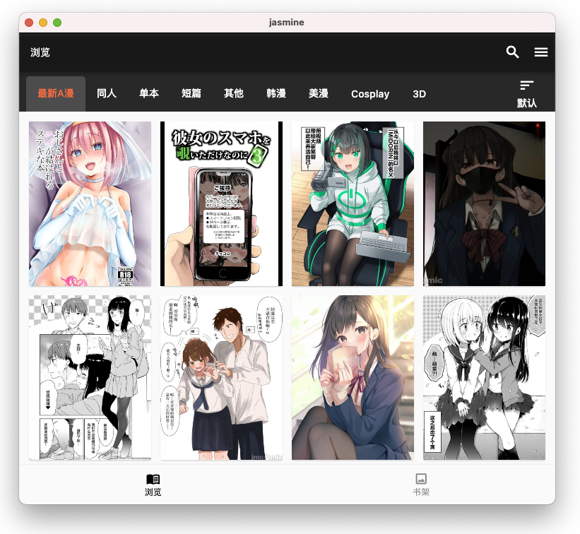

Jasmine Comic
=============

一个简单易用的漫画二次元客户端, 同时支持支持 Android / iOS / MacOS / Windows.

此APP内容存在限制级别内容(露骨/血腥/暴力), 存在请您在遵守当地法律法规的情况下使用。

如果您觉得此软件对您有帮助，可以star进行支持。同时欢迎您issue，一起让软件变得更好。

仓库地址 [https://github.com/niuhuan/nhentai-cross](https://github.com/niuhuan/nhentai-cross)

## 软件截图

#### 浏览器

#### 阅读器

## 实现功能

- [x] 漫画
  - [x] 漫画分类检索
  - [x] 阅读漫画
  - [x] 搜索漫画
  - [ ] 下载漫画
- [ ] 游戏
- [ ] 社区
  - [x] 获取评论
  - [ ] 发布评论
- [ ] 用户
  - [ ] 登录注册
  - [ ] 收藏漫画

## 技术架构

flutter + rust
